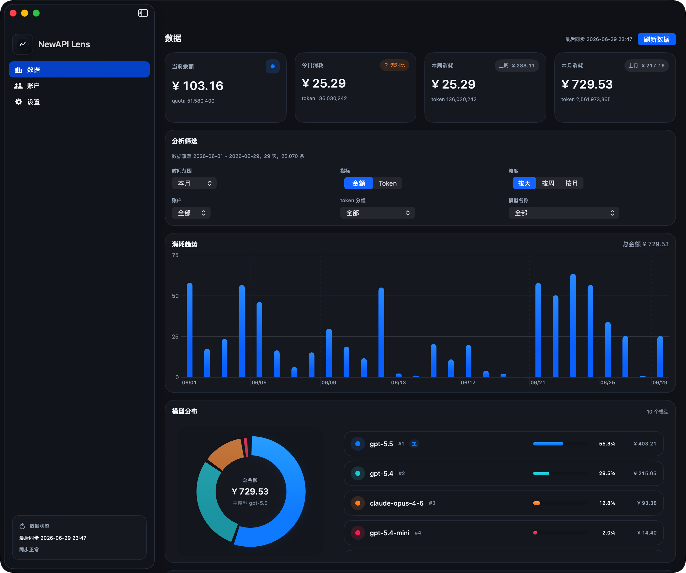

# NewAPI Lens

[English](README.md)

`NewAPI Lens` 是一个面向 macOS 的 `new-api` 账户统计面板，用来集中查看余额、消费、模型分布和阶段趋势。



## 功能

- 多账户管理：支持添加、编辑、删除多个 `new-api` 账户
- 总览看板：查看当前余额、今日、本周、本月消耗
- 趋势分析：按天、周、月查看金额或 Token 变化
- 周期报表：汇总消费情况和模型分布
- 菜单栏入口：可快速查看核心状态
- 自动刷新：按设定间隔自动同步账户数据

## 安装

下载后将应用拖到 `Applications` 目录，再启动即可。

如果 macOS 因“未识别开发者”拦截启动，可执行：

```bash
sudo xattr -rd com.apple.quarantine /Applications/newapi-lens.app
```

如果应用不在 `Applications`，把命令里的路径替换成实际 `.app` 路径即可。

## 许可证

本项目使用 `GNU Affero General Public License v3.0`，见 `LICENSE`。
